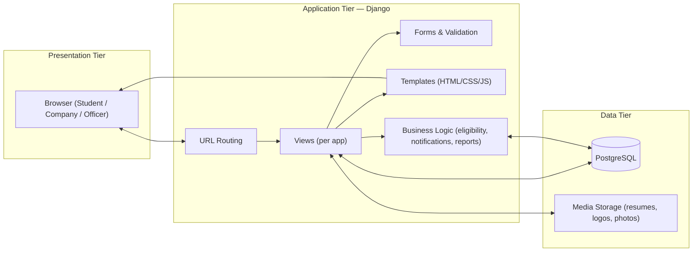
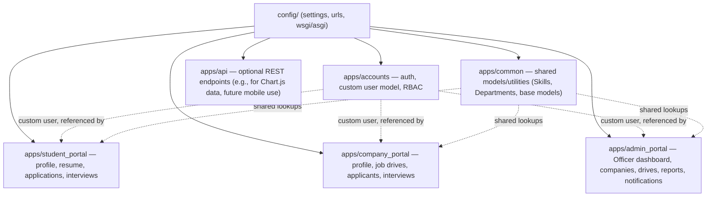
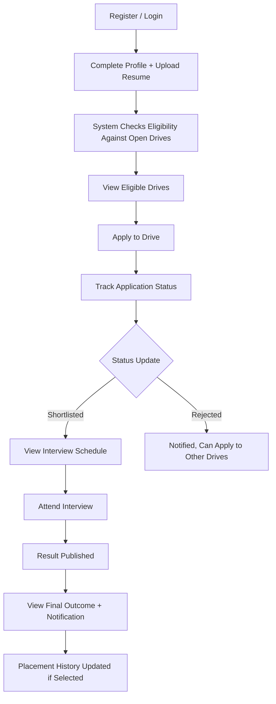
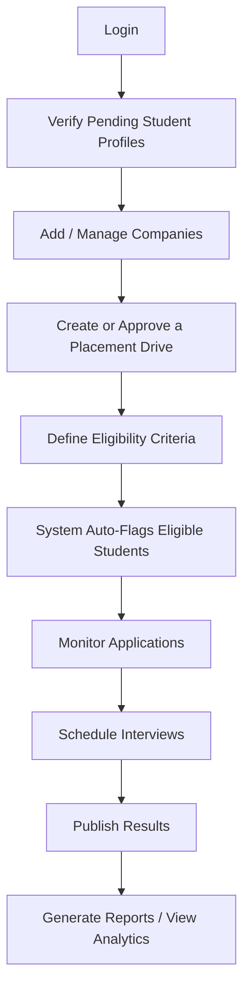
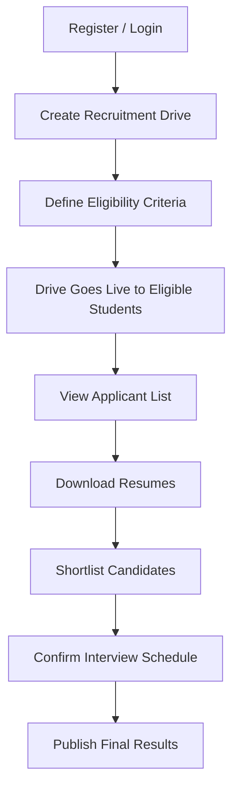
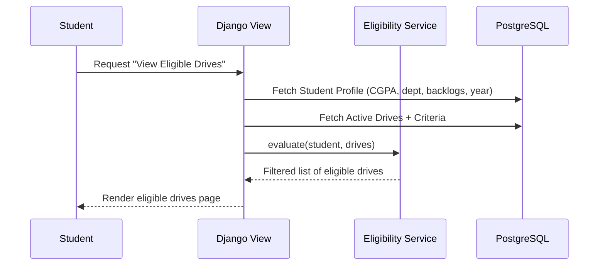
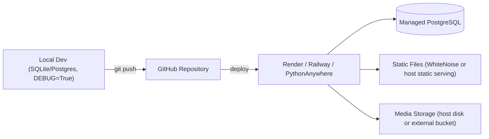

# 03_Architecture.md — System & Application Architecture

## Placement Management Portal

**Document Version:** 1.0
**Depends on:** `01_SRS.md`, `02_Project_Requirements.md`

---

## 1. Purpose

This document defines *how* the system is built: the high-level system
architecture, how requests flow through the app for each user role, the
Django project's folder/file organization, and the technology stack —
with the reasoning behind each choice. `08_Database_Design.md` covers
the schema in detail; this document covers the surrounding structure.

---

## 2. High-Level System Architecture

The system follows a classic **3-tier architecture**, implemented using
Django's MVT (Model-View-Template) pattern.



**Why this shape:** Django's MVT pattern already enforces this
separation, so the architecture leans into the framework rather than
fighting it — important for a project that has to be built and defended
within an academic timeline.

---

## 3. Django Project Architecture

The project is organized as **one Django project** containing **multiple
apps**, split by role/domain rather than by technical layer. This keeps
each role's functionality self-contained and easier to test, review, and
present independently during evaluation.



### App Responsibilities

| App | Owns | Depends On |
|---|---|---|
| `accounts` | Custom user model, registration, login, password reset, RBAC/permissions | — |
| `admin_portal` | Officer dashboard, company management, drive creation/eligibility overrides, interview scheduling, results publication, reports, notifications | `accounts`, `common` |
| `student_portal` | Student profile, resume upload, applications, application-status tracking, interview view | `accounts`, `common` |
| `company_portal` | Company profile, drive creation, applicant review, shortlisting, interview confirmation, results | `accounts`, `common` |
| `common` | Shared/reference data: Skills, Departments, base abstract models (timestamps, etc.) | — |
| `api` | Lightweight JSON endpoints for dashboard charts and any future integrations | `accounts`, `admin_portal`, `student_portal`, `company_portal` |

**Design principle:** a `Student`, `Company`, or `Officer` profile
*extends* the custom user from `accounts` (one-to-one), rather than each
app defining its own disconnected user concept. This keeps
authentication and RBAC centralized (per FR-AUTH-05, NFR-04).

---

## 4. Folder & File Structure

```text
placement_portal/
│
├── manage.py
├── requirements.txt
├── .env
├── config/
│   ├── settings.py        # role-aware settings, installed apps, auth backend
│   ├── urls.py             # root URL conf, includes each app's urls.py
│   ├── asgi.py
│   └── wsgi.py
│
├── apps/
│   ├── accounts/            # custom user model, auth views, RBAC decorators/mixins
│   ├── admin_portal/
│   │   ├── dashboard/        # officer analytics views
│   │   ├── companies/        # CRUD for company records
│   │   ├── drives/           # drive creation, eligibility rules
│   │   ├── reports/           # PDF/Excel report generation
│   │   └── notifications/     # manual + system notification dispatch
│   ├── student_portal/
│   │   ├── dashboard/          # student summary view
│   │   ├── profile/             # profile, skills, projects, certifications
│   │   ├── resume/                # resume upload/storage
│   │   ├── applications/            # apply, status tracking
│   │   └── interviews/               # interview schedule view
│   ├── company_portal/
│   │   ├── dashboard/          # company summary view
│   │   ├── profile/             # company profile, logo
│   │   ├── job_drives/           # drive creation (company-initiated)
│   │   ├── applicants/            # applicant review, shortlisting
│   │   └── interviews/             # interview confirmation
│   ├── common/                # shared models: Skill, Department, base abstract models
│   └── api/                   # JSON endpoints (chart data, etc.)
│
├── templates/
│   ├── admin_portal/
│   ├── student_portal/
│   ├── company_portal/
│   └── shared/               # base layout, navbar, footer, form partials
│
├── static/
│   ├── css/
│   ├── js/
│   ├── images/
│   └── uploads/               # non-user-generated static assets only
│
├── media/                    # user-uploaded content (gitignored, served via Django in dev)
│   ├── resumes/
│   ├── company_logos/
│   └── profile_photos/
│
└── docs/
    ├── README.md
    ├── 01_SRS.md
    ├── 02_Project_Requirements.md
    ├── 03_Architecture.md
    ├── 04_Rules.md
    ├── 05_Phases.md
    ├── 06_Design.md
    ├── 07_Memory.md
    ├── 08_Database_Design.md
    ├── 09_Testing.md
    └── 10_Deployment.md
```

### Conventions

- Each app follows Django's standard `models.py` / `views.py` /
  `urls.py` / `forms.py` layout internally; sub-folders shown above
  (e.g., `drives/`, `resume/`) represent logical groupings of views and
  templates, not necessarily separate Django apps — keep them as
  modules within the parent app unless a sub-area grows complex enough
  to warrant its own app.
- `media/` is never committed to version control; `static/uploads/` is
  reserved for design assets bundled with the app, not user files.
- All cross-app model references (e.g., `Application` referencing both
  a `Student` and a `PlacementDrive`) live in whichever app most
  naturally "owns" the relationship — see `08_Database_Design.md`.

---

## 5. App Flow by Role

### 5.1 Student Flow



### 5.2 Placement Officer (Admin) Flow



### 5.3 Company / HR Flow



### 5.4 Cross-Cutting: Eligibility Check (Sequence)



The eligibility check (per FR-ELG-01–06) is implemented as a shared
service function/module rather than duplicated logic in each view, so
it can be reused by: the student's "eligible drives" view, the
officer's "auto-flag eligible students" view, and the apply-action's
server-side guard (FR-ELG-06).

---

## 6. Authentication & Authorization Architecture

- **Custom User Model** (`accounts.User`) extends
  `AbstractBaseUser`/`AbstractUser`, with a `role` field
  (`student` / `company` / `officer`).
- **Profile extension pattern:** `Student`, `Company`, and
  `PlacementOfficer` models each have a one-to-one relationship to
  `accounts.User`, holding role-specific fields (per FR-STU-01,
  Company Management fields, etc. — see `08_Database_Design.md`).
- **RBAC enforcement:** implemented via Django permission
  classes/mixins (e.g., `StudentRequiredMixin`,
  `CompanyRequiredMixin`, `OfficerRequiredMixin`) applied at the view
  level — never relying on template-level hiding alone (NFR-04).
- **Password handling:** Django's default PBKDF2 hasher (NFR-02); no
  custom hashing implemented.

---

## 7. Notification Architecture

Notifications (FR-NTF-01–05) are generated by a shared `notifications`
service, triggered by specific domain events:

| Event | Triggered By | Recipient |
|---|---|---|
| Drive announced | `admin_portal.drives` on publish | Eligible students |
| Interview reminder | Scheduled job/cron, based on `Interview.datetime` | Applicants with a confirmed interview |
| Result published | `admin_portal.reports` / `company_portal.applicants` on publish | Applicants of that drive |
| Deadline approaching | Scheduled job, based on `PlacementDrive.deadline` | Eligible, not-yet-applied students |

For MVP (per `02_Project_Requirements.md` §3.6), only in-app
notifications for drive announcements and results are required;
scheduled/cron-based reminders and email delivery are Stretch-tier.

---

## 8. Reporting Architecture

- Report data is assembled in the `admin_portal.reports` module via
  Django ORM querysets (aggregations, filters).
- **PDF export:** rendered via WeasyPrint (HTML/CSS to PDF) or
  ReportLab (programmatic PDF), consistent with the stack in
  `01_SRS.md` §2.4.
- **Excel export:** generated via `openpyxl`, writing queryset results
  directly into worksheet rows.
- Reports are generated on-demand (not pre-computed/cached) for MVP,
  since expected data volume is small (single-institution scale).

---

## 9. Technology Stack

| Component | Technology | Rationale |
|---|---|---|
| Backend Framework | Django 5.x | Batteries-included (auth, ORM, admin) — minimizes boilerplate for an academic timeline |
| Database | PostgreSQL | Robust relational integrity for CGPA/eligibility rules and foreign-key-heavy schema |
| Frontend | HTML, CSS, JavaScript (Django templates) | No separate frontend build pipeline needed; faster to build and defend |
| Charts | Chart.js | Lightweight, CDN-friendly, sufficient for dashboard analytics |
| PDF Reports | WeasyPrint / ReportLab | Native Python PDF generation without external services |
| Excel Export | openpyxl | Standard, well-documented library for `.xlsx` generation |
| Authentication | Django Authentication (custom user model) | Centralized, secure-by-default; avoids reinventing session/auth handling |
| Deployment | Render / Railway / PythonAnywhere | Free/low-cost tiers suitable for a student project; simple Django deployment support |

**Note:** the original spec referenced optional Google Authentication
as an auth method. This is treated as a Stretch/Future item — Django's
built-in authentication is the MVP baseline (per
`02_Project_Requirements.md` §3.1), since social auth adds OAuth
configuration overhead not required for core functionality.

---

## 10. Deployment Architecture (Overview)



Full deployment steps, environment variable configuration, and
platform-specific notes are covered in `10_Deployment.md`.

---

## 11. Summary

This architecture keeps the project framework-idiomatic (Django MVT),
splits work cleanly by role so multiple contributors (or a single
student under a timeline) can build and demo one role at a time, and
defers anything requiring extra infrastructure (background jobs, OAuth,
external APIs) to the Stretch/Future tiers defined in
`02_Project_Requirements.md`.