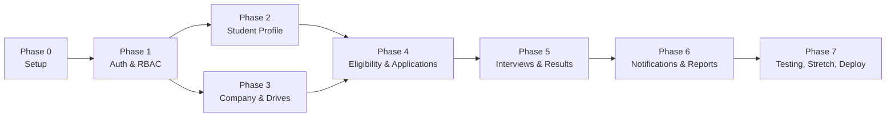

# 05_Phases.md — Project Phases & Timeline

## Placement Management Portal

**Document Version:** 1.0
**Depends on:** `01_SRS.md`, `02_Project_Requirements.md`, `03_Architecture.md`

---

## 1. Purpose

This document breaks the MVP (and, time permitting, Stretch) scope from
`02_Project_Requirements.md` into small, sequential, buildable phases.
Each phase has a clear goal, a task list, requirement IDs it satisfies,
and an exit condition — so progress is always checkable against
something concrete rather than "mostly done."

---

## 2. Phasing Principle

Phases are ordered by **dependency**, not by role. Authentication and
core models come first because every other module depends on them.
The eligibility engine and application flow come before
notifications/reports because those are meaningless without data
flowing through the core loop first. Stretch features are deliberately
last, so a partial build still ends at a working, demoable MVP.

---

## 3. Phase Overview

| Phase | Focus | Primary FR IDs | Suggested Week |
|---|---|---|---|
| 0 | Project Setup & Foundation | — | Week 1 |
| 1 | Authentication & RBAC | FR-AUTH-01, 02, 04, 05 | Week 2 |
| 2 | Student Profile Module | FR-STU-01, 02, 04 | Week 3 |
| 3 | Company & Drive Setup | FR-ADM-01–03, FR-CMP-01, 02 | Week 4 |
| 4 | Eligibility Engine & Applications | FR-ELG-01–04, 06, FR-STU-07–09 | Week 5 |
| 5 | Interviews & Results | FR-ADM-06, 07, FR-CMP-05–07, FR-STU-10 | Week 6 |
| 6 | Notifications, Reports & Dashboards | FR-NTF-01, 03, FR-RPT-01, 05, FR-ADM-08, 09 | Week 7 |
| 7 | Testing, Stretch, Polish & Deployment | See `02_Project_Requirements.md` §4, `09_Testing.md`, `10_Deployment.md` | Week 8 |

This maps to an **8-week timeline**; compress phases (e.g., combine
Phase 0+1, or Phase 5+6) if working under a shorter hackathon window.

---

## 4. Phase Details

### Phase 0 — Project Setup & Foundation (Week 1)

**Goal:** A runnable, empty-but-structured Django project.

**Tasks:**
- Initialize Django project and app skeleton per `03_Architecture.md` §4.
- Configure PostgreSQL connection via `.env` / `django-environ`.
- Set up Git repository, `.gitignore` (exclude `.env`, `media/`).
- Build base templates (`templates/shared/base.html`, navbar, footer).
- Confirm `requirements.txt` matches approved libraries (`04_Rules.md` §4).

**Exit Criteria:** `python manage.py runserver` boots without error;
apps are registered in `INSTALLED_APPS`; base template renders.

---

### Phase 1 — Authentication & RBAC (Week 2)

**Goal:** All three roles can register, log in, and are correctly
restricted to their own areas.

**Tasks:**
- Build custom `User` model with `role` field (`accounts` app).
- Registration forms/views per role (Student / Company / Officer).
- Login, logout, forgot-password flow.
- RBAC mixins/decorators (`StudentRequiredMixin`, etc.) per
  `03_Architecture.md` §6.

**Exit Criteria:** A user of each role can register and log in; a
logged-in Student cannot access an Officer or Company URL (redirect or
403, not a crash).

---

### Phase 2 — Student Profile Module (Week 3)

**Goal:** A student can build a complete profile.

**Tasks:**
- Student profile model + form (name, roll no., university,
  department, semester, CGPA).
- Skills and projects (add/edit/remove).
- Resume upload (PDF, size/type validated server-side per NFR-03).

**Exit Criteria:** A logged-in student can save a profile with resume,
reload the page, and see their saved data persisted.

---

### Phase 3 — Company & Drive Setup (Week 4)

**Goal:** Officers and Companies can create the data a drive needs to
exist.

**Tasks:**
- Officer: manage/verify student profiles, add/manage companies.
- Company: register, create a recruitment drive with job description,
  salary, location, and eligibility criteria fields.
- Officer: create/approve a placement drive.

**Exit Criteria:** An Officer can see a company and its drive in the
admin dashboard; the drive record has eligibility criteria fields
populated (even if not yet enforced).

---

### Phase 4 — Eligibility Engine & Applications (Week 5)

**Goal:** The core matching and application loop works end-to-end.

**Tasks:**
- Build the shared eligibility service (`03_Architecture.md` §5.4):
  CGPA, department, passing year, backlog checks.
- Student "eligible drives" view, filtered via the service.
- Apply action, with server-side eligibility re-check (FR-ELG-06).
- Application status field and student-facing status tracker.

**Exit Criteria:** A seeded eligible student can see and apply to a
drive; a seeded ineligible student cannot (blocked server-side, not
just hidden in the UI).

---

### Phase 5 — Interviews & Results (Week 6)

**Goal:** The full recruitment loop closes — this phase completes the
**MVP Definition of Done** from `02_Project_Requirements.md` §3.

**Tasks:**
- Company: view applicants, download resumes, shortlist candidates.
- Officer/Company: schedule interviews (date, time, venue, panel).
- Student: view interview schedule.
- Officer/Company: publish results (Selected / Waiting List /
  Rejected).

**Exit Criteria:** The MVP Definition of Done in
`02_Project_Requirements.md` §3 passes: apply → shortlist → interview
→ result, fully clickable, no manual DB edits.

---

### Phase 6 — Notifications, Reports & Dashboards (Week 7)

**Goal:** MVP feature-complete.

**Tasks:**
- In-app notifications for drive announcements and result publication
  (FR-NTF-01, 03).
- Officer dashboard analytics: totals, placement %, packages
  (FR-ADM-09).
- Basic student report, PDF/Excel export (FR-RPT-01, 05).

**Exit Criteria:** All MVP items from `02_Project_Requirements.md` §3
are implemented and demonstrable.

---

### Phase 7 — Testing, Stretch, Polish & Deployment (Week 8)

**Goal:** A tested, deployed, demo-ready submission.

**Tasks:**
- Execute the test plan in `09_Testing.md` against all MVP FR IDs.
- Fix defects found during testing.
- If time remains, pick up Stretch items from
  `02_Project_Requirements.md` §4, prioritizing whichever most
  strengthens the demo (e.g., dashboard summaries, department-wise
  reports).
- Set `DEBUG = False`, configure custom error pages
  (`04_Rules.md` §5.1).
- Deploy per `10_Deployment.md`.
- Prepare demo script/seed data walking through the full role loop.

**Exit Criteria:** Deployed instance is reachable, seeded with demo
data, and the full Student → Company → Officer loop can be run live
without errors.

---

## 5. Milestone Checklist

- [ ] Phase 0 — Project boots locally
- [ ] Phase 1 — All 3 roles can register/login, RBAC enforced
- [ ] Phase 2 — Student profile + resume upload complete
- [ ] Phase 3 — Companies and drives can be created
- [ ] Phase 4 — Eligibility engine gates applications correctly
- [ ] Phase 5 — **MVP Definition of Done met** (full loop works)
- [ ] Phase 6 — Notifications, reports, dashboard complete
- [ ] Phase 7 — Tested, polished, deployed, demo-ready

---

## 6. Risks & Buffer

- **Eligibility engine (Phase 4)** is the most logic-heavy piece and
  the most likely to run over — if behind schedule, protect this
  phase's timeline by trimming Phase 6 scope (e.g., defer
  department-wise reports) rather than rushing eligibility logic,
  since FR-ELG-06 is a security-relevant requirement (NFR-04).
- If Phase 7 testing surfaces significant defects, treat fixing them
  as higher priority than adding any Stretch feature — a smaller,
  correct MVP demos better than a larger, buggy one.