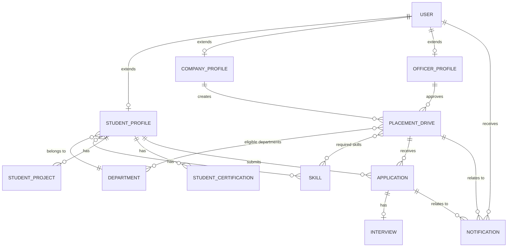

# 08_Database_Design.md — Database Schema & Design

## Placement Management Portal

**Document Version:** 1.0
**Depends on:** `01_SRS.md` (§ Suggested Database Tables), `03_Architecture.md` (app ownership), `06_Design.md` (status enum)

---

## 1. Purpose

This document is the single source of truth for the database schema:
every table, its fields, relationships, and integrity rules. Model
definitions in code should match this document exactly — if they
diverge, update this doc in the same commit (per `04_Rules.md` §2.3).

**Database:** PostgreSQL, accessed via Django ORM (`03_Architecture.md` §9).

---

## 2. Design Approach

- **One custom `User` model, three profile extensions.** Rather than
  three separate, disconnected user tables, a single `accounts.User`
  holds authentication and a `role` field; `StudentProfile`,
  `CompanyProfile`, and `OfficerProfile` each extend it via a
  one-to-one relationship. This is the pattern already fixed in
  `03_Architecture.md` §6 — centralizes auth and RBAC instead of
  duplicating it per role.
- **Lookup tables for repeated values.** `Department` and `Skill` are
  their own tables (not free-text fields), so eligibility filtering,
  reporting, and data consistency don't depend on exact string matches
  across thousands of student records.
- **`Application` is the hinge of the schema.** It's the many-to-many
  join between `StudentProfile` and `PlacementDrive`, carrying the
  status that drives the entire recruitment loop (`02_Project_Requirements.md`
  MVP Definition of Done).
- **No separate `Result` table.** The original spec's "Result
  Management" module (Selected / Waiting List / Rejected) is
  implemented as `Application.status` values, consistent with the
  status set already locked in `06_Design.md` §3.3 and `01_SRS.md`
  FR-STU-09. A distinct "Waiting List" status isn't in that locked set
  — see §8 (Future Considerations) if you want to add it later; doing
  so means updating `06_Design.md`'s status table too, not just the
  database.

---

## 3. Entity-Relationship Diagram

---

## 4. Table Definitions

### 4.1 `User` (app: `accounts`)

| Field | Type | Constraints | Notes |
|---|---|---|---|
| `id` | BigAutoField | PK | |
| `email` | EmailField | unique, not null | Used as `USERNAME_FIELD` |
| `password` | CharField | not null | Hashed via Django's PBKDF2 (per `04_Rules.md` §2.1) |
| `role` | CharField (choices) | not null | `student` / `company` / `officer` |
| `is_active` | BooleanField | default `True` | |
| `is_staff` | BooleanField | default `False` | Django admin access, officers only |
| `email_verified` | BooleanField | default `False` | Supports FR-AUTH-03 (Stretch) |
| `date_joined` | DateTimeField | auto\_now\_add | |

### 4.2 `StudentProfile` (app: `student_portal`)

| Field | Type | Constraints | Notes |
|---|---|---|---|
| `id` | BigAutoField | PK | |
| `user` | OneToOneField → `User` | not null, on\_delete=CASCADE | |
| `full_name` | CharField | not null | |
| `roll_number` | CharField | unique, not null | |
| `university` | CharField | not null | |
| `department` | ForeignKey → `Department` | not null, on\_delete=PROTECT | |
| `semester` | PositiveSmallIntegerField | not null | |
| `cgpa` | DecimalField(3,2) | validator: 0.00–10.00 | Enforced at model level (`04_Rules.md` §5.3) |
| `passing_year` | PositiveIntegerField | not null | |
| `active_backlogs` | PositiveSmallIntegerField | default 0 | |
| `skills` | ManyToManyField → `Skill` | blank=True | FR-STU-02 |
| `resume` | FileField | blank=True, validated PDF, max size | FR-STU-04, NFR-03 |
| `profile_photo` | ImageField | blank=True, validated JPEG/PNG, max size | FR-STU-05 |
| `is_verified` | BooleanField | default `False` | Set by Officer, FR-ADM-01 |
| `created_at` / `updated_at` | DateTimeField | auto\_now\_add / auto\_now | |

### 4.3 `StudentProject` (app: `student_portal`)

| Field | Type | Constraints | Notes |
|---|---|---|---|
| `id` | BigAutoField | PK | |
| `student` | ForeignKey → `StudentProfile` | not null, on\_delete=CASCADE | |
| `title` | CharField | not null | |
| `description` | TextField | blank=True | |
| `link` | URLField | blank=True | Optional GitHub/demo link |
| `created_at` | DateTimeField | auto\_now\_add | |

### 4.4 `StudentCertification` (app: `student_portal`) — *Stretch tier, FR-STU-03*

| Field | Type | Constraints | Notes |
|---|---|---|---|
| `id` | BigAutoField | PK | |
| `student` | ForeignKey → `StudentProfile` | not null, on\_delete=CASCADE | |
| `title` | CharField | not null | |
| `issuing_organization` | CharField | blank=True | |
| `date_earned` | DateField | blank=True | |

### 4.5 `CompanyProfile` (app: `company_portal`)

| Field | Type | Constraints | Notes |
|---|---|---|---|
| `id` | BigAutoField | PK | |
| `user` | OneToOneField → `User` | not null, on\_delete=CASCADE | |
| `company_name` | CharField | not null | |
| `logo` | ImageField | blank=True | |
| `industry` | CharField | blank=True | |
| `website` | URLField | blank=True | |
| `location` | CharField | blank=True | |
| `description` | TextField | blank=True | |
| `is_verified` | BooleanField | default `False` | Officer-verified before drives go live (FR-ADM-02) |
| `created_at` / `updated_at` | DateTimeField | auto\_now\_add / auto\_now | |

### 4.6 `OfficerProfile` (app: `accounts` or `admin_portal`)

| Field | Type | Constraints | Notes |
|---|---|---|---|
| `id` | BigAutoField | PK | |
| `user` | OneToOneField → `User` | not null, on\_delete=CASCADE | |
| `full_name` | CharField | not null | |
| `designation` | CharField | blank=True | |

### 4.7 `Department` (app: `common`)

| Field | Type | Constraints | Notes |
|---|---|---|---|
| `id` | BigAutoField | PK | |
| `name` | CharField | unique, not null | e.g., "Computer Engineering" |
| `code` | CharField | unique, blank=True | e.g., "CE" |

### 4.8 `Skill` (app: `common`)

| Field | Type | Constraints | Notes |
|---|---|---|---|
| `id` | BigAutoField | PK | |
| `name` | CharField | unique, not null | e.g., "Django", "React" |

### 4.9 `PlacementDrive` (app: `common`, cross-referenced by `admin_portal` and `company_portal`)

| Field | Type | Constraints | Notes |
|---|---|---|---|
| `id` | BigAutoField | PK | |
| `company` | ForeignKey → `CompanyProfile` | not null, on\_delete=CASCADE | FR-CMP-02 |
| `title` | CharField | not null | Job/role title |
| `job_description` | TextField | not null | |
| `salary_package` | DecimalField(10,2) | not null | Annual CTC, in a single consistent currency unit |
| `location` | CharField | not null | |
| `eligible_departments` | ManyToManyField → `Department` | not null | FR-ADM-04 |
| `min_cgpa` | DecimalField(3,2) | not null | FR-ELG-01 |
| `max_backlogs` | PositiveSmallIntegerField | default 0 | FR-ELG-04 |
| `eligible_passing_year` | PositiveIntegerField | not null | FR-ELG-03 |
| `required_skills` | ManyToManyField → `Skill` | blank=True | FR-ELG-05 (Stretch) |
| `application_deadline` | DateTimeField | not null | |
| `interview_date` | DateTimeField | blank=True, null=True | Set once scheduling begins |
| `status` | CharField (choices) | not null, default `draft` | `draft` / `published` / `closed` |
| `approved_by` | ForeignKey → `OfficerProfile` | blank=True, null=True, on\_delete=SET\_NULL | FR-ADM-03 approval workflow |
| `created_at` / `updated_at` | DateTimeField | auto\_now\_add / auto\_now | |

### 4.10 `Application` (app: `student_portal`, cross-referenced by `company_portal` and `admin_portal`)

| Field | Type | Constraints | Notes |
|---|---|---|---|
| `id` | BigAutoField | PK | |
| `student` | ForeignKey → `StudentProfile` | not null, on\_delete=CASCADE | |
| `drive` | ForeignKey → `PlacementDrive` | not null, on\_delete=CASCADE | |
| `status` | CharField (choices) | not null, default `applied` | See §6.1 for the locked enum |
| `applied_at` | DateTimeField | auto\_now\_add | |
| `updated_at` | DateTimeField | auto\_now | |

**Constraint:** `unique_together = ('student', 'drive')` — a student
can only have one active application per drive (prevents duplicate
applications, supports FR-STU-08/09 status tracking staying
unambiguous).

### 4.11 `Interview` (app: `admin_portal`, referenced by `company_portal`)

| Field | Type | Constraints | Notes |
|---|---|---|---|
| `id` | BigAutoField | PK | |
| `application` | OneToOneField → `Application` | not null, on\_delete=CASCADE | One interview per application for MVP — see §8 for multi-round |
| `scheduled_date` | DateField | not null | |
| `scheduled_time` | TimeField | not null | |
| `venue` | CharField | not null | Physical venue or "Online" + link |
| `panel` | CharField | blank=True | Interviewer name(s); free text for MVP |
| `created_at` / `updated_at` | DateTimeField | auto\_now\_add / auto\_now | |

### 4.12 `Notification` (app: `common`, dispatched by `admin_portal`)

| Field | Type | Constraints | Notes |
|---|---|---|---|
| `id` | BigAutoField | PK | |
| `recipient` | ForeignKey → `User` | not null, on\_delete=CASCADE | |
| `notification_type` | CharField (choices) | not null | `drive_announcement` / `interview_reminder` / `result_published` / `deadline_alert` / `manual` |
| `title` | CharField | not null | |
| `message` | TextField | not null | |
| `related_drive` | ForeignKey → `PlacementDrive` | blank=True, null=True, on\_delete=CASCADE | |
| `related_application` | ForeignKey → `Application` | blank=True, null=True, on\_delete=CASCADE | |
| `is_read` | BooleanField | default `False` | |
| `created_at` | DateTimeField | auto\_now\_add | |

---

## 5. Relationship Summary

| Relationship | Cardinality | Notes |
|---|---|---|
| User ↔ StudentProfile / CompanyProfile / OfficerProfile | 1 : 0..1 | Only one profile type per user, matching `role` |
| StudentProfile ↔ Department | many : 1 | Each student belongs to one department |
| StudentProfile ↔ Skill | many : many | |
| CompanyProfile ↔ PlacementDrive | 1 : many | A company can post multiple drives |
| PlacementDrive ↔ Department | many : many | A drive can target multiple departments |
| PlacementDrive ↔ Skill | many : many | Optional required-skills filter |
| StudentProfile ↔ PlacementDrive (via Application) | many : many | The core recruitment loop |
| Application ↔ Interview | 1 : 0..1 | One scheduled interview per application (MVP) |
| User ↔ Notification | 1 : many | A user can have many notifications |

---

## 6. Enumerations

### 6.1 `Application.status` (locked — see `06_Design.md` §3.3)

| Value | Design Label | Meaning |
|---|---|---|
| `applied` | Applied | Student has submitted the application |
| `shortlisted` | Under Review | Company/Officer has shortlisted the candidate |
| `interview_scheduled` | Interview | An `Interview` record exists for this application |
| `selected` | Hired | Final positive outcome |
| `rejected` | Rejected | Final negative outcome |

### 6.2 `User.role`

`student` / `company` / `officer`

### 6.3 `PlacementDrive.status`

`draft` / `published` / `closed`

### 6.4 `Notification.notification_type`

`drive_announcement` / `interview_reminder` / `result_published` / `deadline_alert` / `manual`

---

## 7. Data Integrity Rules

- `StudentProfile.cgpa` validated to the range 0.00–10.00 at the model
  level (`clean()`/`MinValueValidator`/`MaxValueValidator`), per
  `04_Rules.md` §5.3.
- `Application` enforces `unique_together('student', 'drive')`.
- `Application.status` transitions should only move forward
  (`applied` → `shortlisted` → `interview_scheduled` → `selected`/
  `rejected`) — enforce this in the service layer
  (`03_Architecture.md` §5.4/§7), not just trust whatever value a form
  submits.
- Server-side eligibility re-check (FR-ELG-06) happens at the moment an
  `Application` is created — never assume the student-facing "eligible
  drives" list is itself the enforcement point.
- File fields (`resume`, `profile_photo`, `logo`) validate both file
  extension and content-type server-side, and enforce a max file size
  (NFR-03).
- `on_delete=PROTECT` on `StudentProfile.department` prevents deleting
  a `Department` that still has students assigned — surfaces data
  integrity issues instead of silently cascading.

---

## 8. Indexes

Beyond Django's automatic PK/FK indexes, add explicit indexes for
frequently filtered/sorted fields:

| Table | Field(s) | Reason |
|---|---|---|
| `User` | `email` | Login lookups (already unique → indexed by default) |
| `StudentProfile` | `roll_number` | Uniqueness + lookup (already unique → indexed by default) |
| `PlacementDrive` | `application_deadline`, `status` | Filtering "active, not-yet-closed" drives |
| `Application` | `(student, drive)` | Already unique together → indexed by default |
| `Application` | `status` | Dashboard/report filtering by status (FR-ADM-09) |
| `Notification` | `(recipient, is_read)` | Unread-count queries on every dashboard load |

---

## 9. Normalization Notes

The schema is in **third normal form (3NF)**: `Department` and `Skill`
are extracted into lookup tables rather than repeated as free text on
every `StudentProfile`/`PlacementDrive` row, and every non-key field
depends only on its table's primary key (e.g., `Application.status`
depends on the application, not on the student or drive independently).
The one deliberate denormalization-adjacent choice is keeping
`Interview` as its own table rather than folding its fields into
`Application` — this keeps `Application` focused on status/lifecycle
and makes it trivial to later support multiple interview rounds (see
§10) without restructuring the core table.

---

## 10. Seed Data (for Phase 0 / demos)

Per `05_Phases.md` Phase 0, seed the following before development
starts so eligibility logic and dashboards have real data to work
against:

- 5–8 `Department` rows (e.g., Computer Engineering, IT, Mechanical,
  Civil, Electrical).
- 10–15 common `Skill` rows (e.g., Python, Django, React, SQL, Java,
  Communication).
- A handful of demo `StudentProfile`, `CompanyProfile`, and
  `PlacementDrive` records spanning different CGPA/department/backlog
  combinations, so eligibility filtering can be visibly tested rather
  than only unit-tested.

---

## 11. Future Schema Considerations (not in MVP)

These are documented so the current schema doesn't accidentally block
them later, per `02_Project_Requirements.md` §5 (Future Enhancements):

- **Multi-round interviews:** would change `Interview` from a
  `OneToOneField` on `Application` to a `ForeignKey` (many interviews
  per application), with a `round_number` field.
- **"Waiting List" status:** if added, update the locked enum in
  `06_Design.md` §3.3 first, then add the value here — don't add it to
  one doc without the other.
- **AI Resume Score:** would add a `resume_score` (float) and
  `resume_score_breakdown` (JSONField) to `StudentProfile`, populated
  by an external scoring step.
- **Resume versioning:** currently `resume` is a single `FileField`
  (latest only); versioning would need a separate `ResumeVersion`
  table with a FK back to `StudentProfile`.